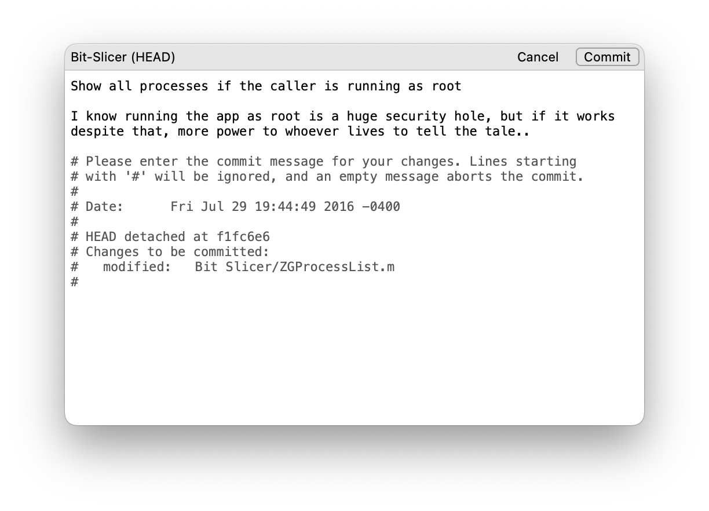
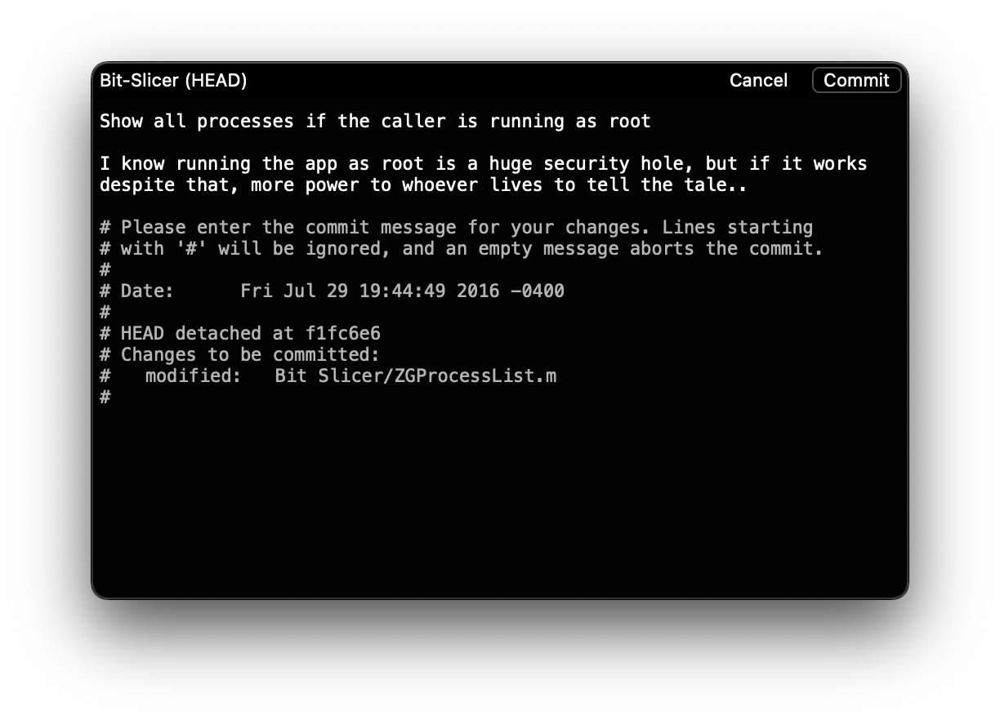

# Komet

A Cocoa text editor designed for creating commit messages.

[Download Komet](https://zgcoder.net/software/komet/Komet.dmg)

## Purpose

I do version control from the command line but I want a fast and non-obstructive editor designed for creating commit messages. Not being stuck in a save-and-close model, applying a commit takes only *one* action in Komet.

## Features

* Single action for applying or discarding a commit.
* Double newline insertion after the first line.
* Cocoa's spell checking and automatic correction.
* Text highlight warning if line becomes too long for subject and/or body.
* Specialized text selection and font handling for message and comment sections.
* Intelligent discarding of commits (i.e, exits on failure if commit file has pre-existing content).
* Ideal caret position on launch after the initial content.
* Support for committing using the Touch Bar.

### Themes

## Requirements

**System Version**: macOS 10.10 or later

**Version Control**: git, hg, svn

Systems prior to macOS 10.10 cannot run Komet due to some appearance settings that are used.

For optimal behavior, Komet depends on being able to distinguish the commit message content and the comment section at the end of the file. Thus, Komet has a small bit of code for handling each of its supported version control systems.

## Contributing

If you enjoy using Komet and feel like something could improve, feel free to make a contribution. It is advisable to create an issue first before submitting a big change. Please also read and follow the code of conduct in the repository first before contributing.

As for one area of improvement may be enhancing the user interface. I'm no expert in UI myself and received a lot of help with the current interface.

**Update**: This project may need some help! I cannot guarantee my activeness in reviewing / pulling in future changes, as well as pushing out new releases.