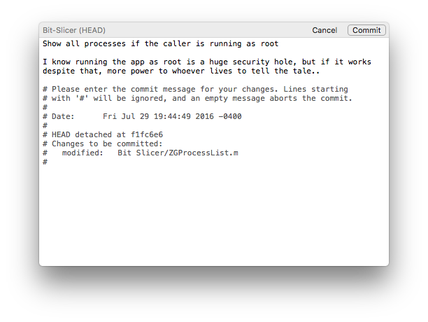

# Komet

A Cocoa text editor designed for creating commit messages

## Purpose

I'm unhappy creating commits in other editors. Not to single out any one in particular, but they are either obstructive, slow, or inconvenient for my tastes. Comitting a message takes only *one* action in Komet.

I am also more comfortable with a native editor and want features such as spell checking and correction that can be found elsewhere.

## Contributing

I hacked this project together in a few nights. If you enjoy using it and feel like something could be made better, feel free to contribute. Please read the code of conduct in the repo before contributing.

I have not made time to add Preferences (there are several user defaults scattered through the code though). I am also not a UI expert and had a lot of help with the existing interface. Improvements could be made there too.

Todo: License will be added soon
